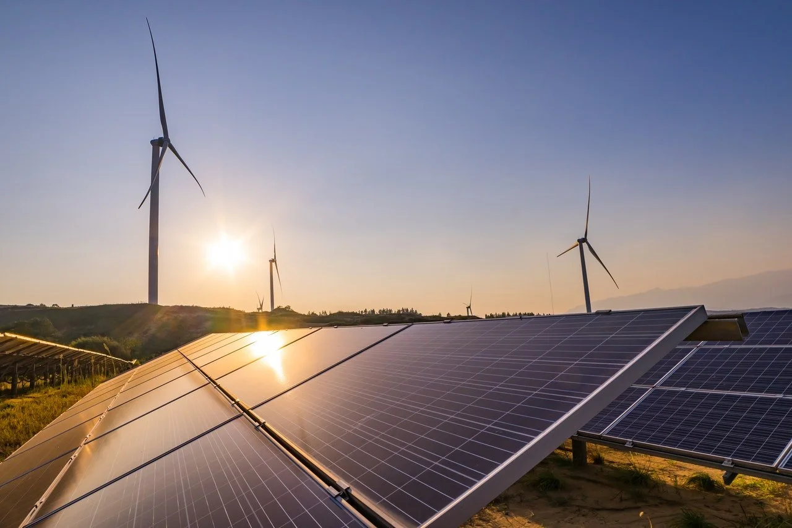
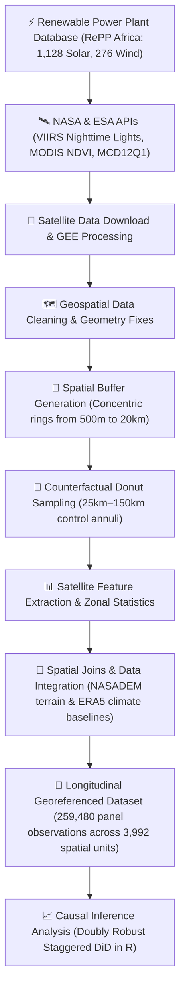
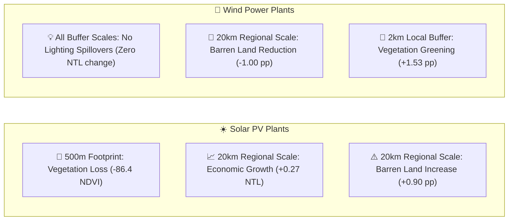

# Geospatial Analysis of Renewable Energy Power Plants in Africa

**Satellite-Based Evaluation of Environmental and Economic Impacts of Solar and Wind Infrastructure**

 

## Overview
Research project developed in collaboration with the University of Padua, investigates the local economic and environmental impact of utility-scale solar and wind power plants across Africa using satellite imagery and causal inference.

Rather than relying on existing datasets, I designed and built an end-to-end geospatial data pipeline that collected, processed, and integrated satellite observations from multiple sources into a longitudinal georeferenced dataset. 

The final dataset was then used to estimate the causal effects of renewable energy infrastructure using state-of-the-art econometric methods.

## Academic Thesis

This project was developed as part of my Master's thesis in **Economic Data Analytics**.

The complete methodology, datasets, econometric framework, and empirical results are described in the full thesis document:

📄 **[Read the full thesis](Thesis.pdf)**

---

---

## What I Built
The core contribution of this project is the creation of a custom geospatial panel dataset from multiple heterogeneous data sources.

The workflow included:
- **Accessing satellite products** through NASA and ESA APIs
- **Downloading multi-year Earth observation data** (2012–2024)
- **Extracting satellite statistics** around thousands of renewable energy plants
- **Cleaning and validating** raw geospatial datasets and geometries
- **Performing spatial joins** and geometric buffer operations (500m to 20km)
- **Building a longitudinal georeferenced panel dataset** with over 259,000 observations
- **Running causal impact analysis** using modern Difference-in-Differences methods

---

## Data Engineering Pipeline
To process satellite imagery at scale, I built an automated ETL workflow combining Python and Google Earth Engine:

---

## Dataset Construction
One of the main challenges of this project was building the analytical dataset from scratch. 

Using Python and Google Earth Engine, I developed an automated workflow to:
- retrieve satellite observations from NASA and ESA products;
- clean inconsistent spatial geometries and missing values;
- generate multiple concentric buffer zones around renewable power plants (500m, 2km, 5km, 10km, 20km);
- extract satellite statistics for each location and year;
- merge heterogeneous geospatial datasets into a single panel dataset ready for econometric analysis.

The resulting dataset contains **over 259,000 observations** describing economic activity, vegetation dynamics, and land cover changes around renewable energy plants between **2012 and 2024**.

---

## Key Empirical Findings
By comparing treated power plant buffers against matched regional control areas, the causal analysis revealed that **solar and wind energy generate completely different environmental and economic footprints**:

### Summary of Results
| Satellite Metric | What It Measures | ☀️ Solar PV Plants | 💨 Wind Power Plants | Simple Takeaway for Recruiters |
| :--- | :--- | :---: | :---: | :--- |
| **VIIRS Nighttime Lights (NTL)** | Local economic activity and electrification | 🟢 **+0.27**  *(20km buffer)* | ⚪ **No Effect**  *(All scales)* | Solar drives regional commercial and grid growth; Wind benefits likely flow via public revenues rather than local lighting. |
| **MODIS NDVI** | Vegetation health and density | 🔴 **-86.41**  *(500m footprint)* | 🟢 **+1.53 pp**  *(2km buffer)* | Solar arrays require initial land clearing; Wind farms act as a greening catalyst by restricting overgrazing. |
| **MODIS Land Cover (Barren %)** | Bare soil and land degradation | 🔴 **+0.90 pp**  *(20km buffer)* | 🟢 **-1.00 to -1.45 pp**  *(All scales)* | **Key Contrast:** Wind acts as a powerful landscape stabilizer in semi-arid areas, while solar requires careful spatial planning. |

---

## Technical Highlights
- 🌍 **Built a custom georeferenced dataset** from multiple satellite products
- 🛰 **Integrated Earth observation data** from NASA and ESA APIs
- 🐍 **Developed the complete geospatial ETL pipeline** in Python
- 🗺 **Performed large-scale spatial analysis** with GeoPandas and Google Earth Engine
- 📊 **Constructed a longitudinal panel dataset** (259,480 observations) for causal inference
- 📈 **Applied the Callaway & Sant'Anna Difference-in-Differences estimator** for staggered adoption
- 🔬 **Produced reproducible geospatial and econometric analyses**

---

## Technologies
- **Data Collection:** NASA APIs, ESA datasets, Remote Sensing, Earth Observation
- **Data Engineering:** Python, Pandas, GeoPandas, Rasterio, Shapely, GDAL, NumPy, Google Earth Engine
- **Data Analysis:** R, did (Callaway & Sant'Anna), Panel Econometrics, Difference-in-Differences, Spatial Econometrics
